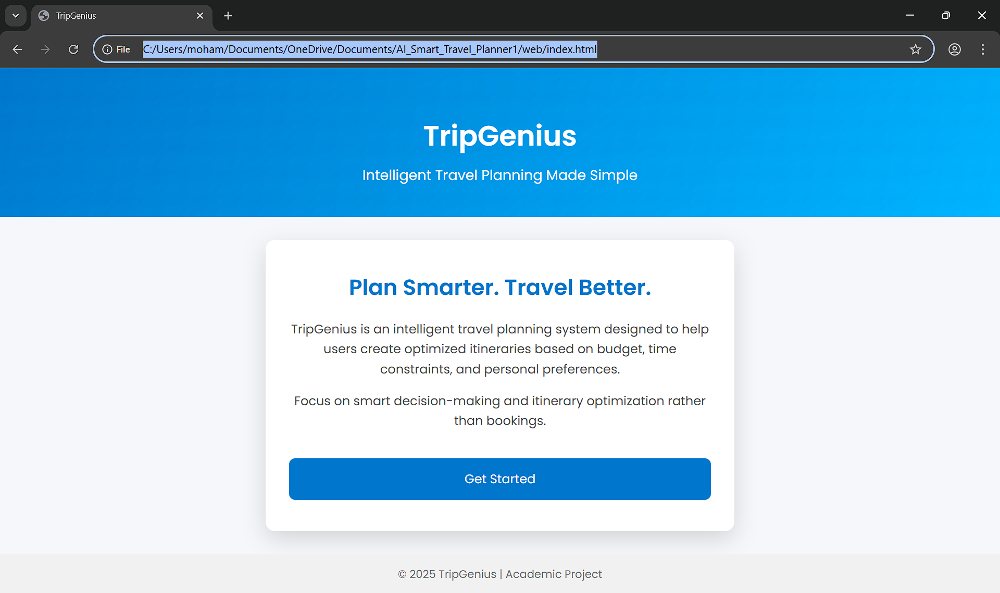
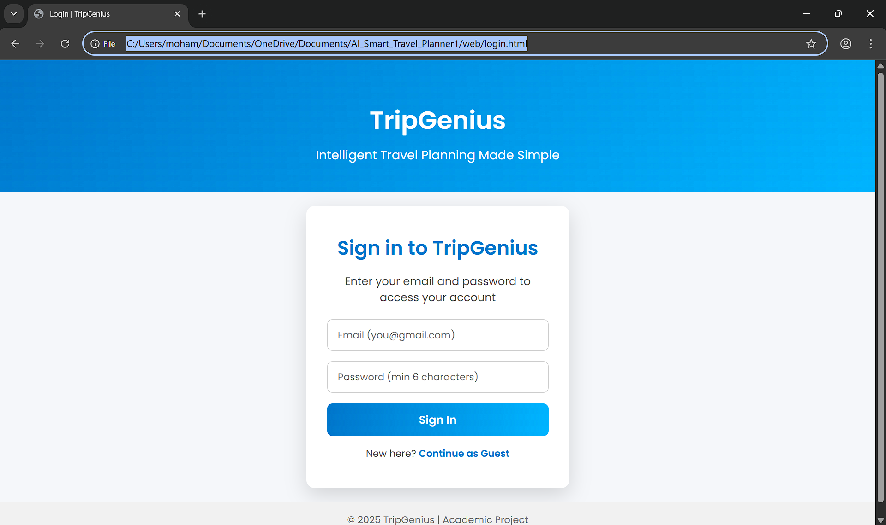
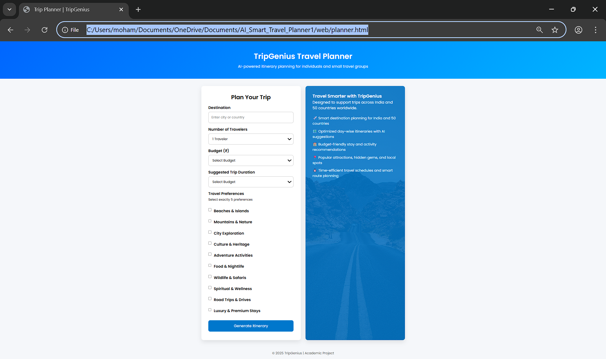
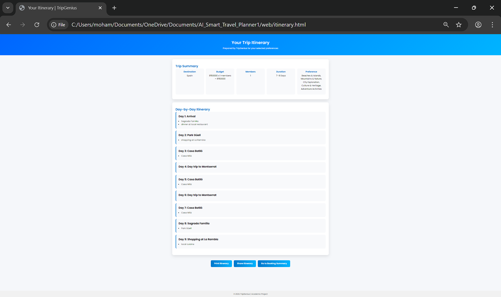
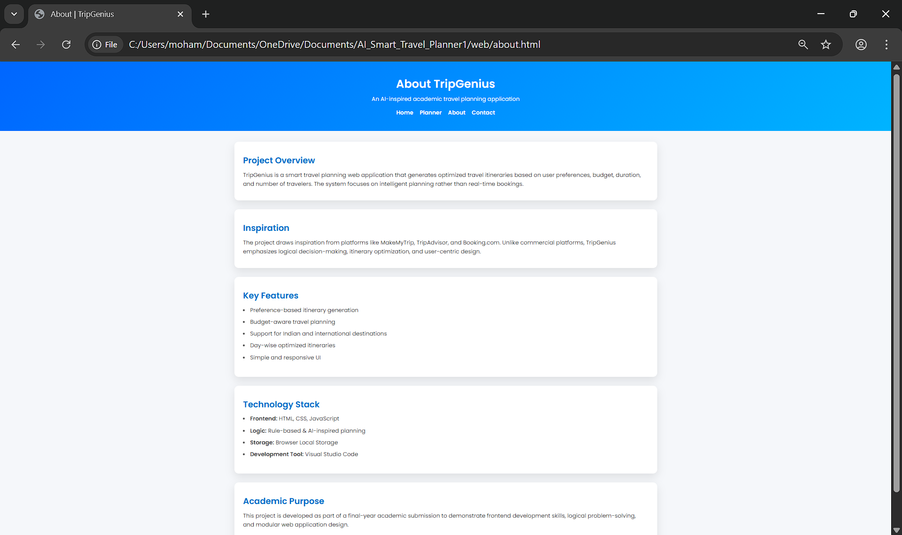
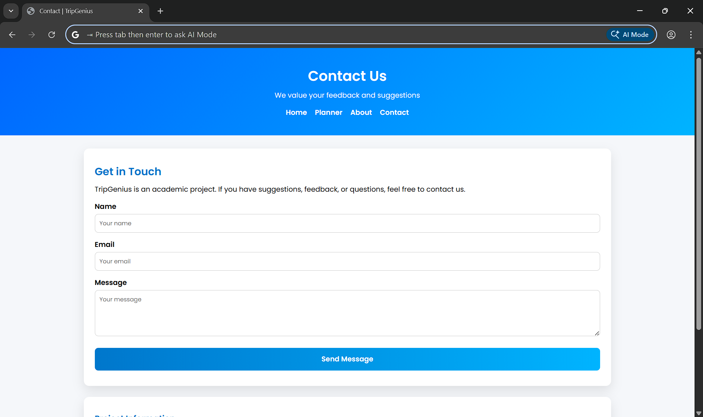
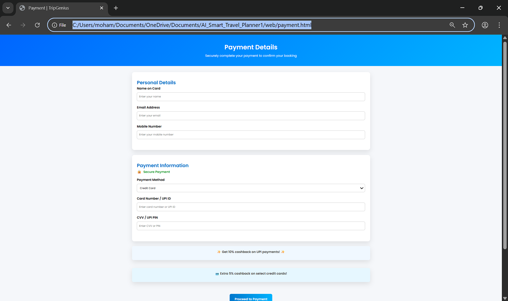

# 📸 TripGenius – Application Screenshots

This folder contains UI screenshots of the TripGenius Smart Travel Planning Application.  
These images demonstrate the complete user flow and key features of the system.

---

## 🏠 Home Page
**File:** index.png  
Entry point of the application showing navigation and overview.
  

---

## 🔐 Login Page
**File:** login.png  
User authentication interface.

---

## 🧭 Trip Planner Page
**File:** planner.png  
Allows users to enter destination, duration, and preferences.

---

## 🗺️ Generated Itinerary
**File:** itinerary.png  
Displays the AI-inspired, day-wise travel plan.

---

## ℹ️ About Page
**File:** about.png  
Provides information about the TripGenius project.

---

## 📞 Contact Page
**File:** contact.png  
Contact form for user communication.

---

## 💳 Payment Page
**File:** Payment.png  
Payment interface for booking confirmation.

---

## 📄 Booking Summary
**File:** Booking Summary.png  
Summary of trip and booking details.

---

## ✅ Booking Confirmation
**File:** Booking Confirmation.png  
Final confirmation screen after successful booking.

